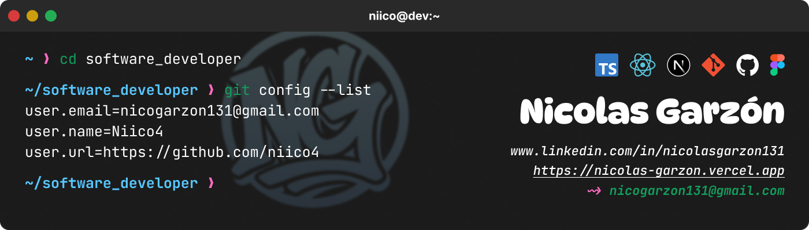

```ascii
┌────────────────────────────────────────────────────────────────┐
│                                                                │
│   [root@niico ~]# whoami                                       │
│   > Frontend Dev | UI/UX Designer | Software Developer         │
│                                                                │
└────────────────────────────────────────────────────────────────┘
```

<div align="center">
  
</div>

<div align="center">

[](https://git.io/typing-svg)

</div>

```ts
// about-me.ts

const dev = {
  name: "Nicolás Garzón",
  role: "Software Developer",
  description: `
    Desarrollador de Software enfocado en el desarrollo Frontend.
    Tengo más de 3 años trabajando en proyectos web reales, priorizando la claridad,
    la funcionalidad y la accesibilidad en cada diseño.
  `,
  location: "Colombia",
};
```

```bash
[root@niico ~]# ls ./tech-stack
```

```yaml
🚀 Stack Principal:
  - MongoDB
  - Express.js
  - React / Next.js
  - Node.js
```

```bash
[root@niico ~]# ls ./skills
```
<div>
  <div align="center">
    
  </div>
  
  <div align="center">
    
    
  </div>
  
  <div align="center">
    
    
    
  </div>
  
  <div align="center">
    
    
    
    
  </div>
  
  <div align="center">
    
    
    
    
    
  </div>
  
  <div align="center">
    
    
    
    
    
    
  </div>
</div>

<br/>

<div align="center">
  
  
</div>

<br/>
<hr/>
<div align="center">
  <a href="https://nicolas-garzon.vercel.app/" >
    
  </a>
  <a href="mailto:nicogarzon131@gmail.com">
    
  </a>
  <a href="https://linkedin.com/in/nicolasgarzon131" >
    
  </a>
  <p align="right">
     
    <a href="https://twitter.com/Niico4_" target="_blank">
        
    </a>
  </p>
</div>
